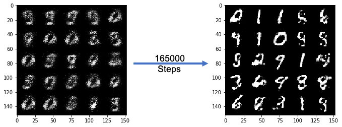
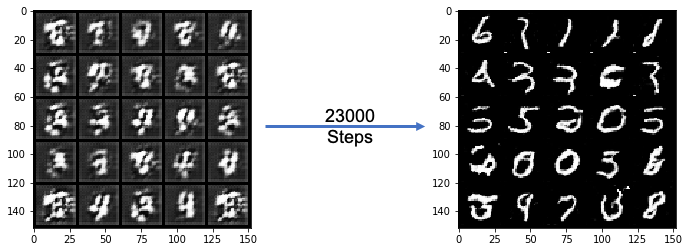

# GANs
Playground for Generative Adversarial Networks (GANs) implementations with PyTorch

## GAN 1: Generating MNIST Handwritten Digits with a simple GAN Architecture
Simple GAN Architecture with fully connected hidden layers. No convolution or pooling layers.

Source Code: [Jupyter Notebook](GAN1.ipynb)

## GAN 2: Generating MNIST Handwritten Digits with a Deep Convolutional GAN (DCGAN)
Source Code: [Jupyter Notebook](DCGAN.ipynb)

### References
1. Goodfellow, Ian, et al. "Generative adversarial nets." 
*Advances in neural information processing systems. 2014.*

2. Radford, Alec, Luke Metz, and Soumith Chintala. "Unsupervised representation learning with deep convolutional generative adversarial networks." 
*arXiv preprint arXiv:1511.06434 (2015)*.

3. *[Coursera Generative Adversarial Networks (GANs) Specialization](https://www.coursera.org/specializations/generative-adversarial-networks-gans)*

